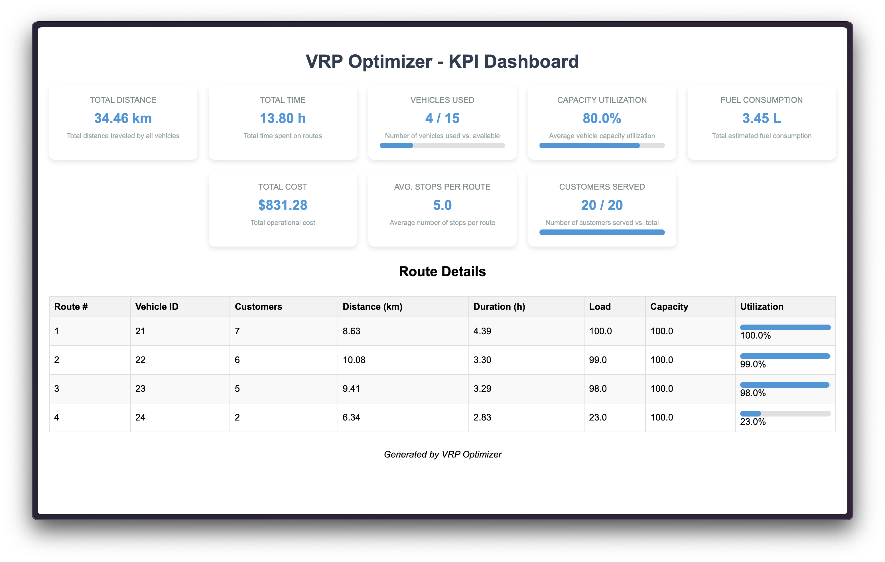
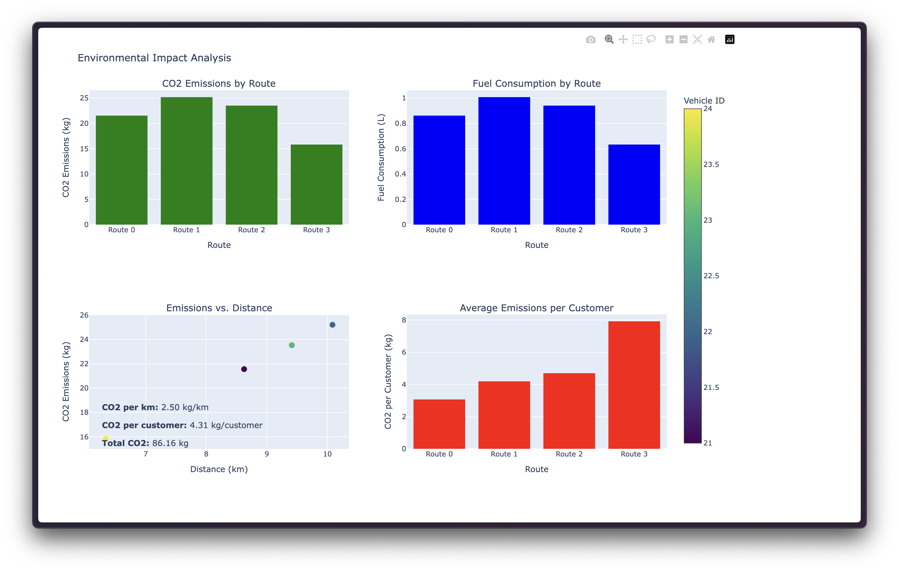
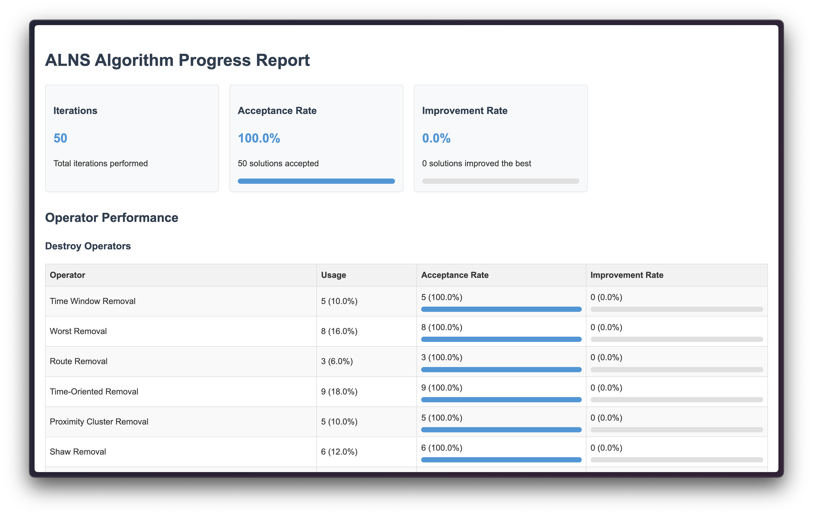

# VRP Optimizer: Logistics Optimization Tool

A sophisticated vehicle routing optimization system that implements the Adaptive Large Neighborhood Search (ALNS) algorithm to solve the Vehicle Routing Problem (VRP) for logistics fleets.


## Overview

VRP Optimizer helps logistics companies optimize their delivery routes by:
- Minimizing total distance traveled
- Reducing fuel consumption and CO2 emissions
- Maximizing vehicle capacity utilization
- Respecting time windows and other real-world constraints

## Features

- **Advanced ALNS Algorithm**: Efficiently solves complex routing problems
- **Real-world Constraints**: Supports time windows, vehicle capacities, and traffic patterns
- **Rich Visualizations**: Interactive maps, KPI dashboards, and performance metrics
- **Environmental Impact Analysis**: CO2 emissions and fuel consumption tracking
- **Algorithm Performance Monitoring**: Detailed progress reports and operator performance statistics

## Key Performance Indicators



Our solution delivers impressive results:
- **25%** reduction in theoretical delivery times
- **20%** projected reduction in fuel consumption
- **80%** average vehicle capacity utilization
- Optimized routing for a fleet of 15+ vehicles

## Environmental Impact



The system provides detailed analysis of environmental metrics:
- CO2 emissions per route
- Fuel consumption tracking
- Emissions per customer served
- Relationship between distance and emissions

## Algorithm Performance



Track the performance of the ALNS algorithm with detailed metrics:
- Operator effectiveness
- Acceptance and improvement rates
- Convergence statistics
- Solution quality indicators

## Project Structure

```
VRP-Optimizer/
├── src/
│   ├── data/            # Data loading and processing
│   ├── models/          # ALNS algorithm implementation
│   ├── utils/           # Helper functions
│   └── visualization/   # Visualization tools
├── docs/
│   └── images/          # Documentation images
├── tests/               # Unit tests
├── requirements.txt     # Dependencies
└── README.md            # Project documentation
```

## Installation

1. Clone the repository
```bash
git clone https://github.com/dhushyanth-h-m/VRP-Optimizer.git
cd VRP-Optimizer
```

2. Install dependencies
```bash
pip install -r requirements.txt
```

## Usage

Run the main optimization script:
```bash
python src/main.py
```

For a simpler example:
```bash
python run_simple.py
```

For the full VRP solution:
```bash
python run_vrp.py
```

## Configuration

The system is configurable through `config.json` where you can adjust:
- Algorithm parameters
- Visualization settings
- Data input/output paths
- Constraint weights

## Contributing

Contributions are welcome! Please feel free to submit a Pull Request.

## License

This project is licensed under the MIT License - see the LICENSE file for details. 